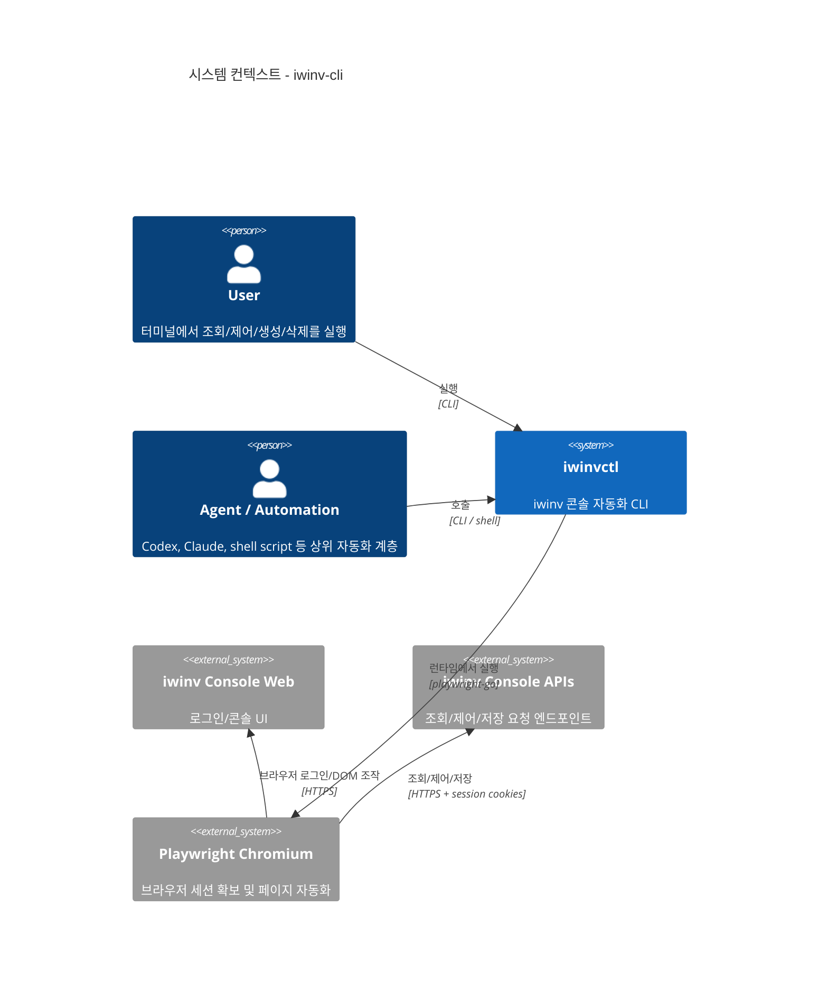
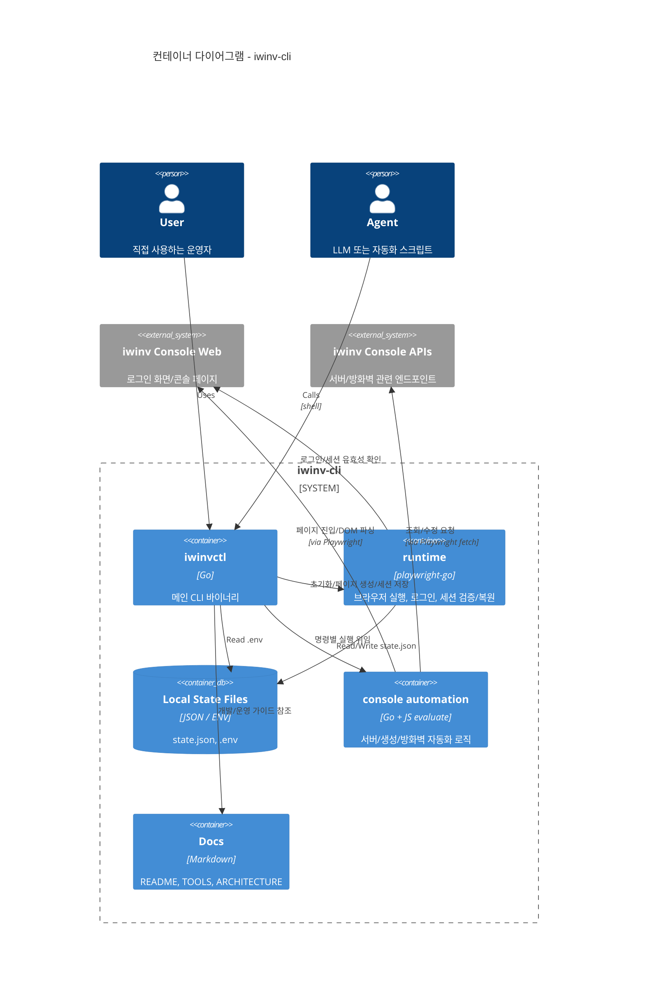
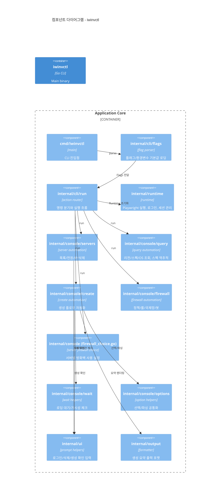
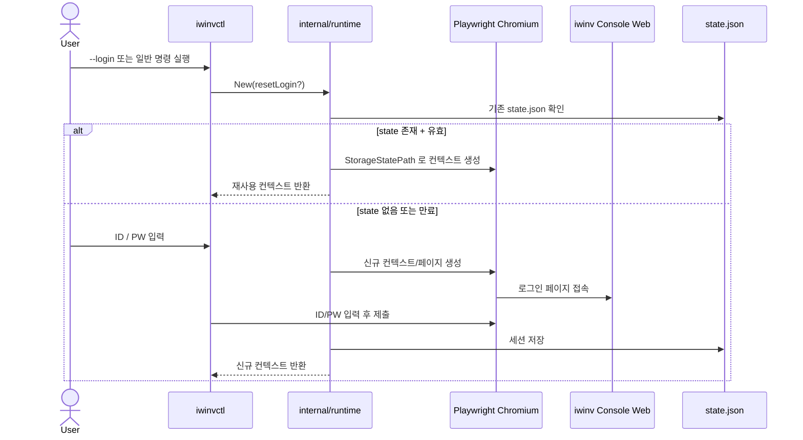
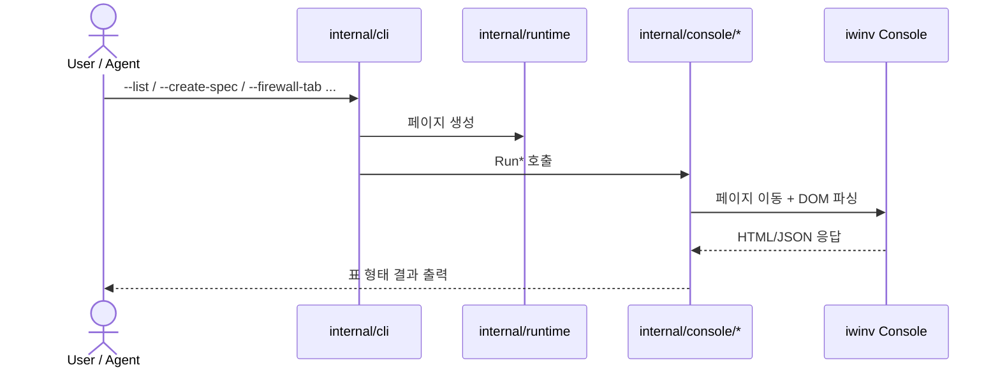
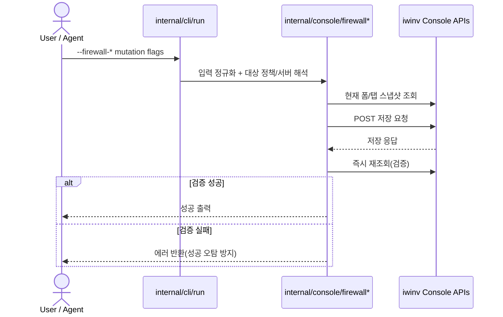
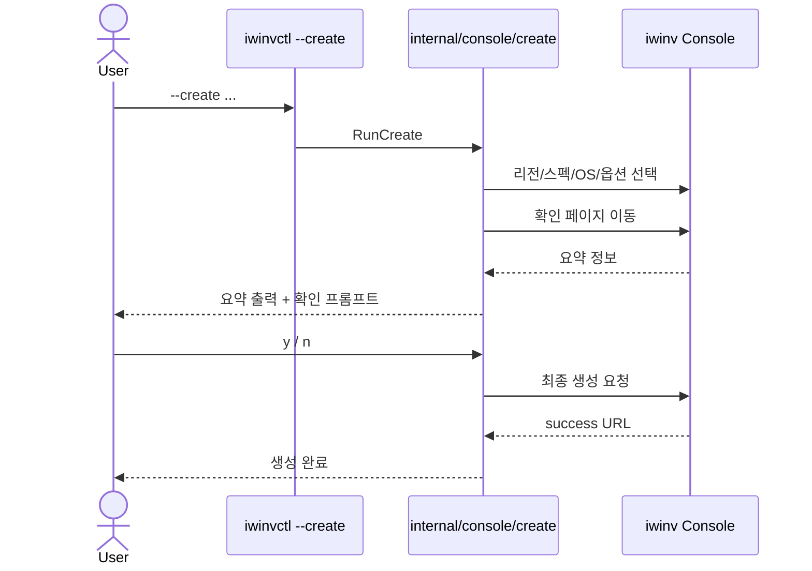

# Architecture

`iwinv-cli`는 iwinv 콘솔 웹 세션을 재사용해 인프라 작업을 자동화하는 비공식 CLI입니다.
현재 구조는 `Playwright 기반 로그인/세션 관리 + Go CLI + 로컬 상태 파일 + iwinv 콘솔 웹 API/DOM 자동화`로 나뉩니다.

이 문서는 현재 저장소 구현을 기준으로 아키텍처를 정리합니다. 목표는 두 가지입니다.

- 사람이 전체 구조를 빠르게 이해할 수 있게 하기
- LLM/자동화 도구가 같은 경계를 기준으로 기능을 안전하게 확장할 수 있게 하기

## 현재 상태

현재 구현 범위는 아래와 같습니다.

- 브라우저 로그인 기반 세션 저장/재사용 (`state.json`)
- 서버 목록 조회
- 서버 전원 제어 (`on/off`)
- 서버 공인 IP 제어 (`on/off`)
- 서버 영구 삭제 (확인 프롬프트 포함)
- 서버 생성 관련 조회
  - 리전 1차/2차 조회
  - 스펙 조회
  - OS 목록 조회
  - 특정 스펙 가능 리전 역추적 검색
- 서버 생성 자동화
  - 리전/스펙/OS 선택
  - 수량/이름 설정
  - 블록 스토리지 선택
  - 방화벽 선택
  - 최종 요약 후 확인 생성
- ELCAP 방화벽 자동화
  - 정책 목록 조회
  - 탭 조회 (`inbound`, `outbound`, `international`, `bot`)
  - 룰 추가/삭제 (`inbound`, `outbound`, `both`)
  - 국제망 정책 설정/개별 제거/전체 제거
  - 검색봇 정책 설정/개별 제거/전체 제거
  - 서버 단위 방화벽 사용 설정 (`firewall/choice`, `use=Y|N`)

## 설계 원칙

- 기본은 조회 중심이며 mutation은 명시적 플래그로만 실행
- 로그인/세션 관리와 도메인 자동화 로직을 분리
- CLI 진입점은 얇게 유지하고 핵심 동작은 `internal/*`로 격리
- 고위험 작업은 추가 확인 또는 사전 검증을 거친 뒤 실행
- 콘솔 DOM 변경에 대비해 XPath/선택 로직을 공통화
- 저장 후 재조회 검증(특히 방화벽 변경)을 통해 성공 오탐 최소화

## System Context

## Container View

## Component View

## Key Flows

### 1. Browser-assisted login and session reuse

### 2. Read-only flow (list/query/firewall-tab)

### 3. Firewall mutation flow (add/remove/international/bot/choice)

### 4. Server creation flow

## Safety Model

mutation(생성/삭제/방화벽 수정)은 아래 순서로 안전 장치를 적용합니다.

1. 세션 게이트
   - 페이지 이동 후 로그인 페이지 여부 검사
   - 세션 만료 시 즉시 중단 + 재로그인 안내
2. 필수 파라미터 게이트
   - 예: `--firewall-ref`, `--rule-ip`, `--rule-port`, `--target` 누락 시 실행 중단
3. 사전 상태 확인
   - 정책/서버 식별자 resolve
   - 중복 룰 검사 또는 삭제 대상 존재 검사
4. 저장 응답 검사
   - HTTP/본문/키워드/JSON 코드 확인
5. 저장 후 재조회 검증
   - 룰 추가/삭제, 국제망/봇, 서버 방화벽 choice는 재조회 결과가 기대와 일치해야 성공 처리
6. 사용자 확인 프롬프트
   - 서버 삭제: 반드시 확인
   - 서버 생성: 최종 요약 확인 후 생성

## Local State

로컬 상태는 아래 파일로 관리됩니다.

| File | Role |
|---|---|
| `state.json` | 브라우저 로그인 세션 저장/재사용 |
| `.env` | 기본 비밀번호 등 환경변수 (`IWINV_PW`) |

기본적으로 `state.json`은 실행 디렉터리(보통 바이너리 실행 위치)에 생성됩니다.

## Package Map

| Package | Role |
|---|---|
| `cmd/iwinvctl` | 명령 진입점 |
| `internal/cli` | 플래그 파싱, 액션 라우팅 |
| `internal/runtime` | Playwright 실행, 로그인, 세션 저장/복원 |
| `internal/console` | iwinv 콘솔 자동화 로직 전반 |
| `internal/console` (`firewall_choice.go` 포함) | iwinv 콘솔 자동화 로직 전반 (서버별 방화벽 사용 설정 포함) |
| `internal/domain` | 공용 타입 |
| `internal/envfile` | `.env` 로더 |
| `internal/ui` | 프롬프트/확인 입력 |
| `internal/output` | 생성 요약 포맷터 |

## Current Gaps

현재 남아 있는 주요 항목입니다.

- 외부 콘솔 DOM/XPath 변경에 취약 (회귀 테스트 자동화 필요)
- 네트워크/API 실패 시 재시도 전략 표준화 미흡
- 일부 mutation에 대해 통합 테스트(실서버 모의 계정 기반) 부족
- 방화벽 관련 기능은 고도화되었지만 API 스키마 변경 시 빠른 탐지 장치 부족

## Related Docs

- [`README.md`](../README.md)
- [`TOOLS.md`](../TOOLS.md)
- [`CLAUDE.md`](../CLAUDE.md)
